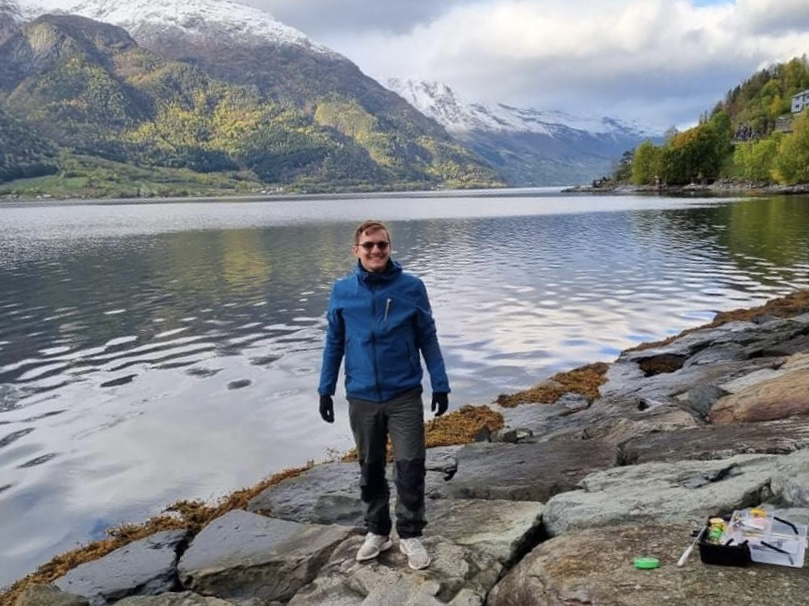

# Mojn/Hello/Goddaw!

<figure>
  
  <figcaption>Image 1 - Me in Norway.</figcaption>
</figure>

My name is Nikolai, and I just joined the most awesome team at Umbraco HQ! 🥳🥳

I am a 28-year-old man originally from Sønderborg, Als. Today I am studying in the last year of my master's in Software Engineering at the University of Southern Denmark (SDU, Odense). I am a commuter as I am currently located in Kolding with my beautiful fiancé. Most of the time I am a huge nerd 🤓; I love to code 👨🏻‍💻, solve problems, and collaborate on interesting projects. However, I also have a very social side, where I love meeting new people, enjoying a cold beer, or sailing 150km (Gudenåen) in 3 days in a canoe with my cousin! 🛶🍻

<figure>
  
  <figcaption>Image 2 - Canoe Trip on Gudenåen.</figcaption>
</figure>

## Why Software? That's nerdy?!

Coding and software development is an unexpected journey for me. A few years back (5 years to be exact) I knew nothing of coding. I was interested in religion, running, rock climbing and fishing, and I was studying nano-technology in Aalborg. As I was trying to find a profession that interested me, I quite randomly fell over software development one summer. I quickly found that I had a flair for programming and that it was super fun! Today it is one of my greatest passions, and I use way too much time starting new nerdy projects, and following different cool open-source projects. From my short amount of time learning software development I have learned that if you put your mind to it, you can accomplish anything! 🤩

## Who am I really? 👀

I am a huge family person, and I am blessed to have 4 nephews, that are the coolest boys in the world! I strive to be the fun uncle, and being around them is a priority of mine. Below is a picture of me and my oldest nephew in the cinema! 

<figure>
  
  <figcaption>Image 3 - Me and my nephew in the cinema.</figcaption>
</figure>

My interests are currently running 🏃🏻, fishing 🎣, travelling ✈️, and playing video games 🎮. At the moment, I am trying to beat Elden Ring, but that game is enormous, and it is very hard! I am not sure if I will ever get there, but luckily, I have a friend who is a gamer too, and he is also a big fan of the game, so we try to beat it together.

Fishing and travelling are something I want to do more often, however studying is hard work, and it occupies most of my time at the moment. I love nature and I am looking forward to finishing my degree in software engineering, so I can enjoy more good fishing trips with friends.

## Why Umbraco?

Well... Umbraco is an awesome company! Umbraco has a lot of amazing people, and one more now that I am a member of the team! 😎 I am a huge fan of the company because we create open-source software and because Content Management Systems are awesome! I believe most companies that provide open-source projects are friendly at the core and are driven by passion. Also Sharing is Caring! 🤝

Another thing that makes me happy, is that Umbraco focuses on creating software that is simple to use, both for developers and content editors. Creating software that is not complex to understand or use is very important to me.

I look forward to working with Umbraco and growing with the team!
